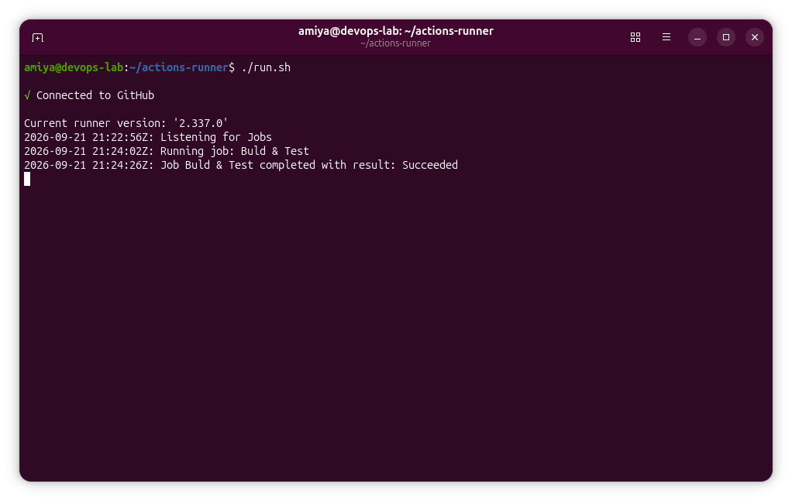

<h1 align="center">Module 5 Assignment: GitHub Self-Hosted Runner</h1>

<div align="center">
  
  <br>
  <em>Showing Successful Runner Job</em>
</div>

---
# Step-by-Step Guide to Configure a GitHub Self-Hosted Runner

## Step 1: Create a GitHub Repository

Create a new GitHub repository named:

```text
github-self-hosted-runner
```

---

## Step 2: Clone the Repository to the Ubuntu VM

Clone the GitHub repository to the Ubuntu VM:

```bash
git clone git@github.com:amiyaadhikary/github-self-hosted-runner.git
```

Navigate to the project directory:

```bash
cd github-self-hosted-runner
```

---

## Step 3: Create a Simple Node.js Project

Initialize a new Node.js project:

```bash
npm init -y
```

This command creates a `package.json` file.

### Create `app.js`

Create a file named `app.js` and add the following code:

```javascript
function add(a, b) {
  return a + b;
}

export { add };
```

### Create `test.js`

Create a file named `test.js` and add the following code:

```javascript
import assert from 'node:assert';
import { add } from './app.js';

assert.strictEqual(add(2, 3), 5);

console.log('All tests passed!');
```

### Configure ES Modules

Because the project uses `import` and `export`, add the following property to `package.json`:

```json
"type": "module"
```

Configure the `scripts` section as follows:

```json
"scripts": {
  "build": "node -e \"console.log('Build successful!')\"",
  "test": "node test.js"
}
```

### Test the Project Locally

Run the build command:

```bash
npm run build
```

Then run the test:

```bash
npm test
```

Expected output:

```text
Build successful!
```

and:

```text
All tests passed!
```

---

## Step 4: Add a GitHub Self-Hosted Runner

Go to the GitHub repository:

**Repository → Settings → Actions → Runners**

Then click:

**New self-hosted runner**

For this environment, select:

* **Operating System:** Linux
* **Architecture:** x64

GitHub will provide the commands required to download and configure the runner.

### Download the Runner

Create a directory for the GitHub Actions runner:

```bash
cd ~
mkdir actions-runner
cd actions-runner
```

Download the runner package:

```bash
curl -o actions-runner-linux-x64-2.337.0.tar.gz -L \
https://github.com/actions/runner/releases/download/v2.337.0/actions-runner-linux-x64-2.337.0.tar.gz
```

Extract the downloaded package:

```bash
tar xzf ./actions-runner-linux-x64-2.337.0.tar.gz
```

> **Note:** The GitHub Actions runner version may change over time. Always use the latest download command provided by GitHub on the **New self-hosted runner** page.

### Configure the Runner

Run the configuration command provided by GitHub:

```bash
./config.sh --url https://github.com/amiyaadhikary/github-self-hosted-runner --token XXXXXXXXXXXXXXXXXXXXX
```

When prompted:

**Enter the name of runner:**

If the default name is:

```text
[press Enter for devops-lab]
```

Enter:

```text
ostad-runner
```

### Runner Labels

The runner will have the following default labels:

```text
self-hosted
Linux
X64
```

When GitHub asks:

```text
Enter any additional labels (ex. label-1, label-2): [press Enter to skip]
```

Enter:

```text
ostad-runner
```

The runner will therefore have the following labels:

```text
self-hosted
Linux
X64
ostad-runner
```

### Runner Work Folder

When GitHub asks:

```text
Enter name of work folder: [press Enter for _work]
```

Press **Enter** to use the default:

```text
_work
```

---

## Step 5: Start the Self-Hosted Runner

Start the runner by running:

```bash
./run.sh
```

The terminal window will remain open because the runner is active and waiting for jobs from GitHub Actions.

You should see a message similar to:

```text
Connected to GitHub

Listening for Jobs
```

**Do not close this terminal while testing the workflow.**

---

## Step 6: Create the GitHub Actions Workflow

Open a **new terminal window**.

Navigate to the project directory:

```bash
cd ~/github-self-hosted-runner
```

Create the GitHub Actions workflow directory:

```bash
mkdir -p .github/workflows
```

Create the workflow file:

```bash
nano .github/workflows/build-test.yml
```

Add the following workflow:

```yaml
name: Build and Test

on:
  push:
    branches:
      - main
  workflow_dispatch:

jobs:
  build-and-test:
    name: Build & Test
    runs-on: [self-hosted, ostad-runner]

    steps:
      - name: Check Runner
        run: |
          echo "Runner is working!"
          hostname
          whoami
          node --version
          npm --version

      - name: Checkout repository
        uses: actions/checkout@v5

      - name: Build
        run: npm run build

      - name: Test
        run: npm test
```

### Understanding `runs-on`

The following line specifies which runner should execute the job:

```yaml
runs-on: [self-hosted, ostad-runner]
```

This means that GitHub Actions requires a runner with both of these labels:

```text
self-hosted
ostad-runner
```

Therefore, GitHub Actions will send the job to the Ubuntu VM where the `ostad-runner` self-hosted runner is running.

Save the file and exit `nano`.

---

## Step 7: Push the Workflow to GitHub

Check the repository status:

```bash
git status
```

Add all changes:

```bash
git add .
```

Commit the changes:

```bash
git commit -m "Add self-hosted runner build and test workflow"
```

Push the changes to the `main` branch:

```bash
git push origin main
```

The `push` event will trigger the GitHub Actions workflow.

---

## Step 8: Check the Self-Hosted Runner Terminal

Go back to the terminal where the self-hosted runner is running:

```bash
./run.sh
```

After the workflow is triggered by the `git push`, the runner will receive the job.

The terminal will display information about the job being executed.

You should eventually see a message similar to:

```text
Job ... completed with result: Succeeded
```

The workflow steps are executed directly on the Ubuntu VM.

---

## Step 9: Verify the Successful Job in GitHub Actions

Open the GitHub repository and go to:

**Repository → Actions**

You should see the workflow:

```text
Build and Test
```

A successful workflow will show:

🟢 **Success**

Click the workflow to view the job details.

You should see a structure similar to:

```text
Build and Test

└── Build & Test
    ├── Check Runner
    ├── Checkout repository
    ├── Build
    └── Test
```

### Check Runner Output

The **Check Runner** step will display information such as:

```text
Runner is working!
<hostname>
<username>
v26.x.x
npm x.x.x
```

### Build Output

The **Build** step will show:

```text
Build successful!
```

### Test Output

The **Test** step will show:

```text
All tests passed!
```

---

## Final Result

The GitHub repository is now configured with a **self-hosted GitHub Actions runner** running on an Ubuntu VM.

The workflow successfully:

1. Connects to the self-hosted runner.
2. Checks the runner environment.
3. Checks out the repository.
4. Runs the Node.js build.
5. Runs the automated test.
6. Reports the result back to GitHub Actions.

This confirms that the **GitHub Self-Hosted Runner is working successfully**.

---

## Technologies Used

* GitHub
* GitHub Actions
* GitHub Self-Hosted Runner
* Linux / Ubuntu
* Node.js
* npm
* Git
* YAML
* JavaScript

---

## Assignment Status

**GitHub Self-Hosted Runner:** ✅ Successfully Configured

**Runner Name:**

```text
ostad-runner
```

**Runner Environment:**

```text
Linux x64
```

**Runner Labels:**

```text
self-hosted
Linux
X64
ostad-runner
```

**Workflow:**

```text
Build & Test
```

**Status:**

```text
Success
```
